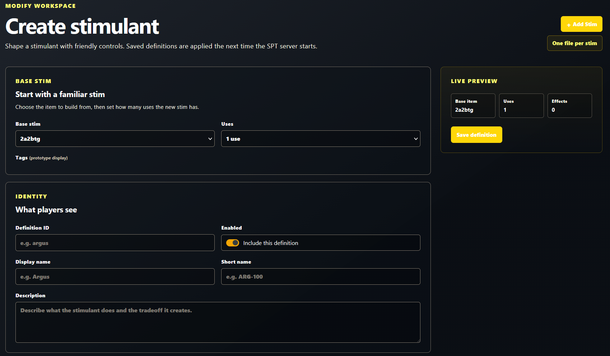
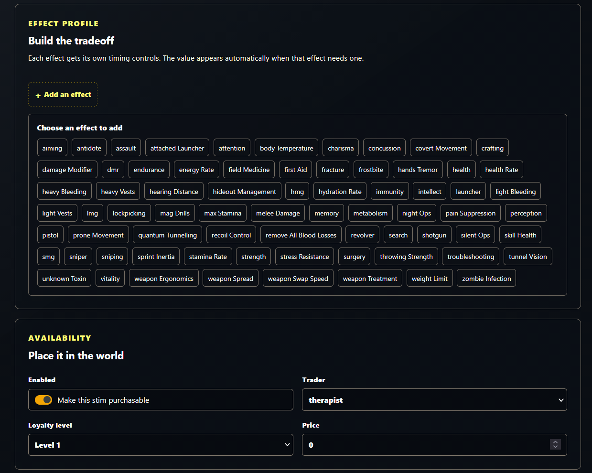
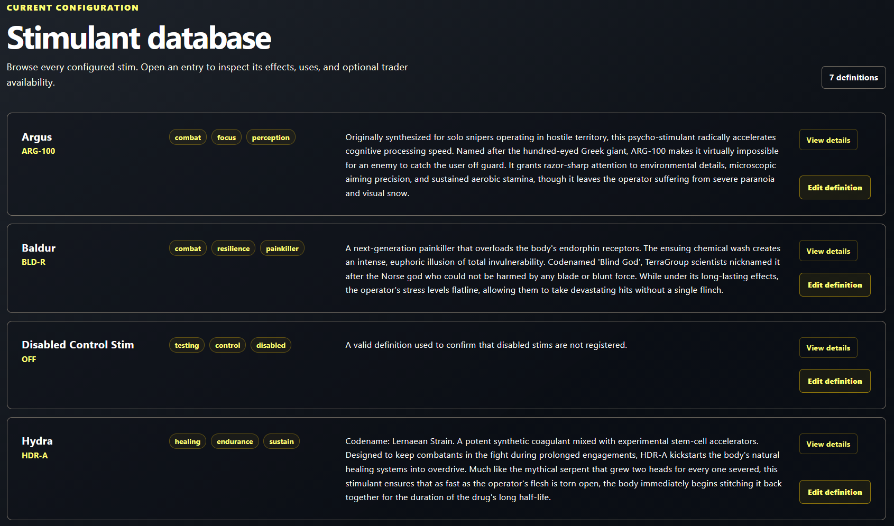

# Moar Supplies

**Moar Supplies** is a server mod for **SPT 4.1.2** that lets you create, tune, and sell configurable consumable items without working with T***** template IDs or SPT database structures.

It includes a built-in web workshop for everyday editing and a clear JSON format for anyone who prefers to work directly with files. Define an item's identity, base item, uses, effects, timing, price, and trader; Moar Supplies turns that friendly definition into a persistent in-game supply.

> **Version:** 0.6.1  
> **SPT compatibility:** 4.1.x (tested with 4.1.2; `~4.1.2`)  
> **License:** All Rights Reserved



## What it does

- Creates configurable consumable items by cloning a supported vanilla item.
- Creates configurable medical-kit clones while preserving the base kit's native treatment effects.
- Uses readable names such as `propital`, `healthRate`, and `therapist` instead of raw SPT IDs.
- Lets you add beneficial effects, tradeoffs, durations, and delayed effects.
- Gives each definition stable internal IDs, so items already in a profile remain valid after a normal server restart.
- Adds enabled items to world loot and, when selected, to supported traders with a configurable rouble price and loyalty level.
- Provides a server-side web workshop to browse, create, edit, enable/disable, and delete definitions.
- Stores definitions as one readable JSON file per item and validates the complete configuration before registering anything.

## Install

1. Install and launch **SPT 4.1.2** once.
2. Download the Moar Supplies release archive and extract it into your SPT installation directory. The archive already contains the required SPT folder structure:

   ```text
   <Your SPT folder>/SPT_Runtime/user/mods/AnotherBudgetGamer-MoarSupplies/
   ```

3. Confirm that the mod folder contains `MoarSupplies.dll`, `config/`, and `wwwroot/`.
4. Start the SPT server. The server log should report that Moar Supplies loaded its configuration and registered its enabled item definitions.
5. Open the SPT server's web interface and select **Moar Supplies** from the navigation. The workshop is available at `/moar-supplies`.

The included definitions provide a working starting set. You can leave them as-is, edit them, or create your own.

## Use the workshop

The web interface is the recommended way to manage items and supplies. It is designed to keep SPT-specific implementation details out of the way.



1. Open **Moar Supplies → Database** to inspect existing definitions.
2. Select an item, or choose **Add Stim** in **Modify**. (The current UI label is retained for compatibility.)
3. Choose a base item and number of uses.
4. Enter the player-facing name, short name, and description.
5. Add effects and set each effect's value, duration, and optional delay.
6. Optionally make the item purchasable through a supported trader. All enabled items remain available in world loot; this setting only controls trader sales.
7. Save the definition, then **restart the SPT server** before starting the game to apply it in-game.

Saved definitions are written to `config/stims/`, one file per item. The workshop tells you about validation errors before it writes a change.



### A note about restarts

Changes made in the workshop are saved immediately, but they are intentionally registered only during server startup. Restart the server after adding, editing, enabling, disabling, or deleting an item. This keeps generated item IDs stable and protects supplies already stored in a profile.

## Update or uninstall

Always close SPT before updating or removing Moar Supplies.

To update, extract the new release archive into the SPT installation and allow it to replace the existing AnotherBudgetGamer-MoarSupplies folder. Your existing config/ folder contains your workshop changes and custom definitions, so back it up before updating if those definitions matter to you.

To uninstall, first back up your SPT profile and remove or consume every Moar Supplies item from your PMC and scav inventories. Then delete this folder:

```text
<Your SPT folder>/SPT_Runtime/user/mods/AnotherBudgetGamer-MoarSupplies/
```

Moar Supplies can be removed without leaving server files behind, but custom item templates may still be referenced by an existing profile. After removal, start the server and load the affected profile to verify it is healthy. If you encounter a profile problem, restore your backup; SPT profile repair is not guaranteed.

## Configure with JSON

Direct JSON editing is useful for sharing definitions, keeping them in source control, or making many changes at once. Definitions live here:

```text
config/
  settings.json
  stims/
    argus.json
    hydra.json
    your-item.json
  medical-packs/
    field-afak.json
```

`settings.json` contains the configuration format version and optional debug logging:

```json
{
  "version": 1,
  "debug": false
}
```

Each file in `config/stims/` contains one item definition. This is the full shape of an item:

```json
{
  "id": "example-item",
  "enabled": true,
  "identity": {
    "name": "Example Item",
    "shortName": "EX-1",
    "description": "A configurable supply with a clear tradeoff."
  },
  "baseItem": "propital",
  "uses": 1,
  "tags": ["combat", "example"],
  "buffs": [
    {
      "effect": "maxStamina",
      "value": 10,
      "duration": 120,
      "delay": 0
    },
    {
      "effect": "handsTremor",
      "value": 0.25,
      "duration": 45,
      "delay": 120
    }
  ],
  "trader": {
    "enabled": true,
    "trader": "therapist",
    "loyaltyLevel": 2,
    "price": 35000
  }
}
```

### Field reference

| Field | Meaning |
| --- | --- |
| `id` | Permanent, unique definition ID. Use lowercase letters, numbers, and single hyphens only. Do not casually rename an ID after items have entered a profile. |
| `enabled` | When `false`, the definition is kept but not registered in-game. |
| `identity` | The name, short name, and description shown to players. All three are required. |
| `baseItem` | The vanilla consumable to clone. See [Supported base items](#supported-base-items). |
| `uses` | Number of uses provided by the new item. Must be greater than zero. |
| `tags` | Optional workshop labels; up to eight, each 32 characters or fewer. They do not change gameplay. |
| `buffs` | An array of effects. Each effect has a duration in seconds (maximum 1,800 seconds / 30 minutes) and may have a delayed start. |
| `trader` | Optional trader availability. Set `enabled` to `false` to keep the item out of trader inventories; enabled items remain available in world loot. |
| `trader.traderId` | Optional stable SPT trader ID. The workshop writes this automatically for every selection; it lets Moar Supplies target a modded trader reliably while retaining its friendly name. |

Definitions are loaded as a complete set. If any definition is invalid, Moar Supplies reports the errors and registers no items, preventing a partly updated setup.

### Supported base items

`2a2btg`, `3btg`, `adrenaline`, `ahf1m`, `etgchange`, `l1`, `meldonin`, `mule`, `obdolbos`, `obdolbos2`, `p22`, `perfotoran`, `pnb`, `propital`, `sj1`, `sj6`, `sj9`, `sj12`, `trimadol`, `xtg12`, `zagustin`, and `morphine`.

### Supported drink base items

`aquamari`, `apple-juice`, `emergency-water-ration`, `grand-juice`, `hot-rod`, `ice-green-tea`, `kvass`, `max-energy`, `milk`, `moonshine`, `pevko`, `pineapple-juice`, `purified-water`, `ratcola`, `tarcola`, `tarkovskaya-vodka`, `vita-juice`, `water`, and `whiskey`.

### Food

Food definitions live in `config/foods/` and follow the drink workflow: choose a vanilla food base, resource, hydration and energy, identity, tags, and optional trader availability. Food deliberately has no timed-effect editor.

Supported food bases: `alyonka`, `army-crackers`, `condensed-milk`, `emelya-rye-croutons`, `herring`, `humpback-salmon`, `instant-noodles`, `iskra-lunch-box`, `izhora-sprats`, `jar-of-devildog-mayo`, `large-beef-stew`, `mre`, `pack-of-oat-flakes`, `peas`, `rye-croutons`, `salty-dog-sausage`, `saury`, `slickers`, `small-beef-stew`, `squash-spread`, `sugar`, and `tarker-dried-meat`.

### Medical packs

Medical-pack definitions live in `config/medical-packs/`. They clone the base item's treatment behavior (including what it can treat) and expose only the two values that are safe to tune independently:

```json
{
  "id": "example-medical-pack",
  "enabled": true,
  "identity": {
    "name": "Example Medical Pack",
    "shortName": "EMP",
    "description": "A configurable medical kit."
  },
  "baseItem": "afak",
  "resource": 480,
  "resourceRate": 60,
  "tags": ["medical"],
  "trader": {
    "enabled": true,
    "trader": "therapist",
    "loyaltyLevel": 1,
    "price": 40000
  }
}
```

`resource` follows the cloned item's native resource behavior: it is a total HP pool for med kits, a surgery-use count for surgical kits, and can be zero for a one-use treatment item. `resourceRate` is the health restored per treatment where the base supports it. For surgical kits, `surgeryRestoreMultiplier` adjusts the restored limb health and `useTimeMultiplier` adjusts the base animation time; for example, `1.2` restores 20% more health and `0.5` takes half as long.

Supported medical bases: `afak`, `ai2`, `car`, `ifak`, `salewa`, `grizzly`, `sanitar-afak`; `cms`, `surv12`, `sanitar-surgery-kit`; `bandage`, `army-bandage`, `cat`, `esmarch`, `calok-b`; `splint`, `alu-splint`; `golden-star`, `vaseline`; and `analgin`, `augmentin`, `ibuprofen`.

### Supported traders

All vanilla traders are supported: `therapist`, `prapor`, `skier`, `peacekeeper`, `mechanic`, `ragman`, `jaeger`, and `fence`. The workshop also discovers every enabled trader mod that has registered with SPT, displaying its friendly trader name while saving its stable internal ID. Trader availability controls purchasing only: items not available from a trader remain in world loot. Trader loyalty levels must be from 1 through 4, and a sale price must be greater than zero.

### Supported effects

The workshop presents the available effects. JSON authors can use the friendly effect keys below; raw SPT `BuffType` or skill IDs are never needed.

<details>
<summary>Show effect keys</summary>

`aiming`, `antidote`, `assault`, `attachedLauncher`, `attention`, `bodyTemperature`, `charisma`, `concussion`, `covertMovement`, `crafting`, `damageModifier`, `dmr`, `endurance`, `energyRate`, `fieldMedicine`, `firstAid`, `fracture`, `frostbite`, `handsTremor`, `health`, `healthRate`, `heavyBleeding`, `heavyVests`, `hearingDistance`, `hideoutManagement`, `hmg`, `hydrationRate`, `immunity`, `intellect`, `launcher`, `lightBleeding`, `lightVests`, `lmg`, `lockpicking`, `magDrills`, `maxStamina`, `meleeDamage`, `memory`, `metabolism`, `nightOps`, `pain`, `painSuppression`, `perception`, `pistol`, `proneMovement`, `quantumTunnelling`, `recoilControl`, `removeAllBloodLosses`, `revolver`, `search`, `shotgun`, `silentOps`, `skillHealth`, `smg`, `sniper`, `sniping`, `sprintInertia`, `staminaRate`, `strength`, `stressResistance`, `surgery`, `throwingStrength`, `troubleshooting`, `tunnelVision`, `unknownToxin`, `vitality`, `weaponErgonomics`, `weaponSpread`, `weaponSwapSpeed`, `weaponTreatment`, `weightLimit`, and `zombieInfection`.

</details>

Some status effects do not take a `value`; the workshop handles this automatically. For JSON, omit `value` for `antidote`, `concussion`, `fracture`, `frostbite`, `heavyBleeding`, `lightBleeding`, `painSuppression`, `removeAllBloodLosses`, `tunnelVision`, `quantumTunnelling`, and `unknownToxin`.

`painSuppression` is a stimulant-only direct item effect, matching vanilla morphine. `pain` is separate and deliberately applies the harmful pain condition.

## Included supplies

The release configuration includes five enabled example supplies—Argus, Baldur, Hydra, Ravana, and Svarog—plus a disabled control definition. It also includes three enabled medical-pack test clones: Moar AFAK (480 pool / 60 per treatment), Moar CALOK-B (four treatments), and Moar Grizzly (2,160 pool / 210 per treatment). All three are sold by Therapist level 1. Treat them as editable examples rather than a required balance preset.

## Troubleshooting

**The mod does not appear in the web interface**  
Verify the release contents were extracted without an extra nested folder, then check the SPT server log for a load error. Moar Supplies must be installed as a server mod for SPT 4.1.2.

**My changes are saved but not in-game**  
Restart the SPT server, then launch the game. Definitions are applied at server startup.

**No Moar Supplies items registered after startup**
Read the server log. Moar Supplies validates every definition before making any SPT database changes; a malformed JSON file, duplicate ID, unsupported base item/effect/trader, or invalid price can stop the entire set from loading. Set `"debug": true` in `config/settings.json` for more detailed logging.

**An item vanished after I changed it**
Check whether its `enabled` field is still `true`. Also avoid changing a definition's `id` once items using it are in a profile: the ID is the stable identity used to derive the in-game item template.

## Post-1.0 experimental roadmap

Version 1.0 focuses on a stable, user-editable catalog of vanilla-base supplies: medical kits, surgery kits, bleeding treatments, splints, balms, consumables, drinks, and stimulants. The supported editing controls preserve the selected vanilla item's native use behavior.

After 1.0, the first experimental track is **cross-item timed effects**. This would test attaching Moar Supplies buffs and debuffs to item classes that do not normally use them—for example, a bandage that applies a short health-regeneration effect after treating bleeding. It is intentionally deferred because each medical item type must be validated in raid for client behavior, resource consumption, animations, effects timing, and profile safety before it can be considered stable.

The 1.0+ workshop roadmap also includes a **stim-definition backup/export** option, so users can easily copy their custom stim definitions somewhere safe before making changes. A companion **delete all shipped stims** control will let users remove the full set of default Moar Supplies stimulants at once when they prefer not to use them.

Experimental effects will remain opt-in and clearly labeled until they have been tested across the supported item families.

## For developers

Moar Supplies is a C# server mod built for .NET 10 and SPT 4.1.2. The important boundary is deliberate: JSON and the web UI use friendly concepts, while the services resolve internal SPT IDs, clone item templates, register buff collections, and add trader assort entries.

```text
Friendly definition / workshop
            ↓
Validation and stable ID generation
            ↓
Base-item and effect resolution
            ↓
SPT item clone, buff registration, trader registration
            ↓
Persistent in-game item
```

The main code is organized as follows:

| Path | Purpose |
| --- | --- |
| `Models/` | Friendly configuration models. |
| `Definitions/` | Internal mappings for base items, effects, and traders. |
| `Validation/` | Whole-configuration validation. |
| `Services/` | Loading, storage, stable IDs, item creation, buffs, and trader registration. |
| `Web/` and `wwwroot/` | SPT web workshop and its assets. |
| `config/` | Shipped settings and item definitions. |

### Build locally

The project expects the SPT runtime assemblies from a local SPT 4.1.2 installation. By default, it looks for them at `../spt-read-only/SPP-T*****/SPT_Runtime/` relative to the project. Point MSBuild at another runtime with `SptRuntimeDirectory` if needed.

```powershell
dotnet build -c Release
```

This creates `ReleaseZip/AnotherBudgetGamer-MoarSupplies-0.6.1.zip`, ready to extract into an SPT installation.

To use a different runtime location:

```powershell
dotnet build -p:SptRuntimeDirectory="C:\path\to\SPT_Runtime\"
```

### Deploy locally

`Deploy.ps1` builds the same release and installs it locally at `user/mods/AnotherBudgetGamer-MoarSupplies`. It preserves an existing `config/` folder, so workshop changes and custom definitions are not overwritten.

```powershell
.\Deploy.ps1
```

Specify another runtime when needed:

```powershell
.\Deploy.ps1 -SptRuntimeDirectory "C:\path\to\SPT_Runtime"
```

## Contributing and feedback

Bug reports and improvement ideas are welcome through this repository's GitHub Issues once the repository is public. When reporting a configuration problem, include the relevant item-definition JSON and the Moar Supplies portion of the SPT server log—without sharing personal profile data.

Moar Supplies is built around experimentation. Please back up your SPT installation and profile before changing a live setup, especially before removing or renaming definitions that may already exist in a stash.
